# Table of Contents

[Project Proposal](#project-proposal)

[Feasibility Study](#feasibility-study)

[Requirements](#requirements)

[Cryptography Analysis](#feasibility-study)

[Database Design](#database-design)

[Server design](#server-design)

[Client Design](#client-design)

[Testing](#testing)

[Evaluation](#evaluation)

# Project Proposal

**Project Title –** Secure Change tracking software

**Focus Course Area** - Database Design & Development

**Integrated Course Area** - Software Design & Development

**Problem Outline** - An organisation needs to log changes to files in a
way that makes it hard for *anyone* to fake the change history of the
file, including the administrators.

## Detailed Explanation

Two programs will be created:

-   An HTTP server/API which interacts with the database and acts as
    a &gt; central file store.

-   A desktop application that uses this API.

Asymmetric Encryption & Hashing will be used to prevent faking file
history.

A server will store one or more files. Changes to each file are tracked
by history statements.

Each history statement consists of the hash of the last history
statement, a hash of the submitted file after changes were made, and an
optional comments field. This would then be signed by one user’s public
key (the author).

This means in order to change one part of the file’s history, you would
need to have not only one user’s private key (to change then re-sign the
statement), but also that of everyone who changes the file afterwards,
since their history statements all depend on the hash of the one you
change. Otherwise, it will be obvious which part has been tampered with.

The server won’t store any private keys but will associate each user
with a public key. This means even the server owner cannot impersonate
other users without accessing their computer. Users will authenticate to
the server without sending their private key.

The end-users will be non-technical people.

The server will use a database to track files and history statements, as
well as users and who has access to which file. Both the client and the
server will use object oriented programming and the client will also use
sorting and search algorithms.

## Scope/Boundaries

The deliverables for this project are:

-   Server and client programs

-   End-User documentation

-   Design documentation, including wireframes, pseudocode, an ERD and
    a &gt; data dictionary

-   A test plan and the results of testing

-   An evaluation report

Newly created implementations of existing encryption/hashing algorithms
will be used. This will include generating prime numbers,
encryption/decryption and hashing.

In order to increase performance, the server will support
multi-threading.

The server will verify the integrity of each history statement as it is
recorded. If it diverges from the history kept on the server, it will be
rejected.

Any user’s public key is always publicly viewable, along with their
username. Each file is stored independently of all others. Owners always
have full access to their own files (this cannot be transferred). Files
cannot be deleted, only archived.

# Requirements

## User Requirements

In the below diagram and user requirements, the system boundary contains
both the client and the server.

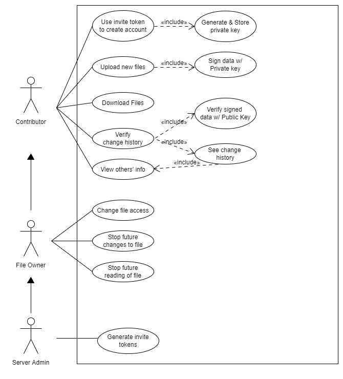

## Functional Requirements

### Common

-   Both the client and the server should be able to verify
    messages &gt; given a signed message and a public key.

-   Both should be able to hash files.

### Client

-   It should be able to create a new user on the given server, given
    an &gt; invite token, the details to have for the new user (name &
    bio) &gt; and generate a private key for the user

-   It should be able to symmetrically encrypt private keys on disk.

-   It should be able to upload a new file to the server (one not
    based &gt; on a previous).

-   It should be able to download files from the server

-   It should be able to link local files to the server they were
    from &gt; and the corresponding file on that server.

-   It should be able to detect what files have changed locally and
    let &gt; the user upload their changes.

-   It should be able to generate a history statement for the
    changes &gt; made and sign it with the correct private key for the
    server it &gt; was downloaded for.

-   It should be able to upload the file and history statement back
    to &gt; the server and report errors to the user.

-   It should be able to display and verify the history of any file
    the &gt; user has read access to.

-   It should be able to change the options for a file the user
    owns &gt; (sealed or archived).

-   It should be able to change the permissions for a file the user &gt;
    owns.

### Server

-   The server should be able to generate invite tokens and allow
    users &gt; to create a new account using them.

-   The server should let users sign up with an invite token and
    their &gt; information (name, bio and public key).

-   The server should be able to link a public key to a single user.

-   The server should be able to store some basic information about &gt;
    users, including name, bio and public key.

-   The server should be able to accept a file upload and history &gt;
    statement along with the file ID the upload is based on.

    -   It should be able to verify the history statement is valid for
        the last/new file and is correctly signed.

-   The server should store current and historical versions for
    every &gt; file.

-   The server should be able to limit the people who can &gt;
    download/modify files based on what the owner specifies.

-   The server should be able to store all history statements for a &gt;
    file.

-   The server should let authorised users download current or &gt;
    historical versions.

# Feasibility Study

## Technical Feasibility

This is whether the technology exists for the software to be developed,
or if it’s possible to make that technology within the given time &
budget constraints.

The software needed for the server to handle HTTP requests and interact
with a database already exists and is widely deployed in other
applications. The same applies to the client’s GUI.

Whilst the cryptographic implementation will be from scratch, various
algorithms have already been designed and tested and are publicly
available. This means the project is technically feasible.

## Economic Feasibility

This is whether the solution is cost-effective, including server costs
and licensing fees, as well as if it’s a worthwhile investment for an
organisation.

The server will likely require a higher disk capacity than other servers
since it’s storing historical files, meaning it will cost more to
purchase. Alternatively, cloud hosting could be used, which would reduce
server costs when the application is not actively being used and would
make it easier to add/remove disk space. Since this is a proof of
concept, this isn’t a problem, however its impact in the real world
would depend on the type of files being tracked.

As only open-source software is being used, no license fees are
required, meaning the system only requires the cost of running the
server.

Using the application will make auditing changes to a sensitive file
much easier, which may be required for compliance in some industries,
for example when dealing with digital evidence. It may also be
reassuring to some stakeholders, for example when dealing with sensitive
data.

## Legal Feasibility

This is whether the software can be realistically used without breaking
the law, particularly with regards to data protection.

Names and some personal data may be stored by the system in order to
identify users, which could have legal implications because of the GDPR.
This may cause problems if, for example, a user leaves the organisation
or asks for their data to be deleted/modified, which would leave the
database incomplete. Since this is a proof of concept, this isn’t
considered a problem, and the software is legally feasible.

## Schedule Feasibility

This is whether it’s realistic to develop and deploy the software in the
timeframe given, and if there’s enough time to deal with any unforeseen
obstacles that may arise.

Below is a plan showing the expected timeline of the project. This chart
puts the end point before the final deadline I was given (March
13th) which gives extra time if task(s) take longer than
expected.

| Milestone | Task                        | Start      | End        | Duration |
|:----------|:----------------------------|:-----------|:-----------|:---------|
| Analysis  | Feasibility Study           | 2019-11-19 | 2019-11-19 | 1        |
| Analysis  | Requirements                | 2019-11-20 | 2019-11-20 | 1        |
| Analysis  | Cryptography Research       | 2019-11-22 | 2019-11-28 | 7        |
| Design    | Cryptography Design         | 2019-11-29 | 2019-12-01 | 3        |
| Design    | Database Design             | 2019-12-02 | 2019-12-03 | 2        |
| Design    | Client UI Design            | 2019-12-04 | 2019-12-10 | 7        |
| Design    | Server Design               | 2019-12-11 | 2019-12-17 | 7        |
|           | BREAK                       | 2019-12-21 | 2020-01-26 |          |
| Server    | Cryptography Implementation | 2020-01-27 | 2020-01-31 | 5        |
| Server    | Database Implementation     | 2020-02-01 | 2020-02-02 | 2        |
| Server    | Server Implementation       | 2020-02-03 | 2020-02-13 | 11       |
| Client    | Client Implementation       | 2020-02-14 | 2020-02-19 | 6        |
| Testing   | Crypto Testing              | 2020-02-20 | 2020-02-22 | 3        |
| Testing   | Integration Testing         | 2020-02-23 | 2020-02-29 | 7        |

# Cryptography Research

The following is a brief explanation of the functionality of each type
of algorithm used, as well as some notes on the implementation and
choice of algorithm. The full design of each algorithm can be found from
many sources online and as internal commentary in the source code.

## Hashing

Hashing is a process by which some data of unknown size is turned into a
fixed size signature. Ideally, it should be impossible to get the data
from the hash alone and there should be no other input data that
generates this signature. It’s sometimes also known as a random oracle.

### Algorithm Choice

MD5 is now considered broken[1], and while earlier SHA algorithms
haven’t been thoroughly cracked, they’re no longer considered secure for
many purposes[2]. Therefore, SHA-2 with 256 bits will be used, as it is
used in many other applications and is generally considered secure.

## Asymmetric Encryption

Asymmetric cryptography lets you encrypt a message using a key that is
shared publicly, and then allows the encrypted message to be decrypted
using a private key which can be kept secret. The private key can’t be
derived from the public key or from the message, meaning this is often
used to accept messages from anyone who has your key without letting
others read them.

The inverse also works, meaning you can encrypt a message with your
private key and anyone with your public key can decrypt it. Whilst this
isn’t useful on its own, if you know what a message, or part of a
message, should be, and you decrypt it to get that, you can know the
sender does hold the private key. This is known as message signing.

### Theory

The following is not meant as complete proof of the
security/functionality of RSA, rather as a general overview of why it is
difficult to break and why it can be reliably reversed.

RSA relies on the fact that numbers are much easier to multiply than to
factorise. This difference gets more pronounced the bigger the numbers
are, meaning big enough numbers are almost impossible to factorise, but
can still be multiplied relatively quickly.

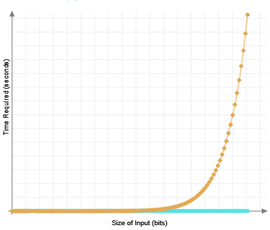

Factorisation vs Multiplication Time Complexity[3]

It can be shown that every non-prime (composite) number can eventually
be factorised down to prime numbers, for example:

2 \* 2 \* 5 \* 5 \* 5 = 22 \* 53 = 500

Each combination of primes is unique to one composite number, and every
composite number, by definition, has a prime factorisation. This means
if we take 2 primes and multiply them together, we know our original
primes are the only prime factors of that number.

*n* = *p* \* *q*

This also makes it easy to calculate *ϕ*(*n*). Since p and q are prime,
from Euler’s Totient Theory[4]:

*ϕ*(*p*\**q*)

 = (*p* − 1)(*q* − 1)

We now choose *e* (not the constant), which is coprime to *ϕ*(*n*). Then
we find d such that *d**e* = 1 (mod ϕ(*n*)), which we can do using the
extended Euclidean algorithm.

This gives us the public key: (e, n) and the private key: (d,n).

If we have a number M to encrypt (M &lt; n), we simply use these
functions:

Enc(*M*) = *M**e* (mod n)

Dec(*C*) = *C**d*(mod n)

For our uses, signing a number M looks like this:

Sign(*M*) = *M**d*(*m**o**d* *n*)

And if the following is true, C was encrypted using the private key:

*C**e*(mod n) = *M*

### Practical Considerations

#### Finding p and q

Proving a large number to be prime is far too costly to generate keys,
so instead tests that give a high probability of a given number being
prime will be used, and random numbers generated till we get 2 that have
a high enough probability.

Since every prime takes the form 6*n*+ 1 or 6*n* – 1 (except 2 and 3),
we can generate n randomly and put it in the above equations until we
generate our 2 primes.

Fermat’s Theorem dictates that if *x* is prime,
*a**x* − 1 = 1(*m**o**d* *x*) for any values of *a* less than
*x*[5] However, it’s possible for a number to pass this test even if it
isn’t prime, so another test is needed.

It can be shown that *x* is prime if and only if
*n*2 = 1(mod x) only when *n* = ± 1. [6] So if we can find
*n* such that *n*2 (modx) ≠  ± 1,  *n* &lt; *x* , we know
that n is not prime. If we take *n*2 = *a**x* − 1,
where a is from our previous Fermat Test, we know that if x is prime
it’s also odd, and thus x-1 is even. This means we can also write
*a**x* − 1 = *a*2*s**d* (d is odd).
This means that for the sequence:

*a**d*2*s* (mod x), *a**d*2*s* − 1 (mod x), *a**d*2*s* − 2, ..., *a**d* (*m**o**d* *x*)

Each number is a square root of the previous number. If x is prime then
for this sequence, either every number is 1, or the first number that
isn’t 1 is x - 1.

These 2 techniques can be combined to generate numbers that are likely
to be prime at a relatively low computational cost. Since this will only
be used for key generation, it’s not *as* important that this function
is fast.

#### Finding e

*e* being (relatively) small makes encryption more efficient without
affecting security.

Most commonly, e is taken as 65,537 and if this isn’t coprime to
*ϕ*(*n*), we choose a different p and q. This is because it’s a
relatively large known prime which can fit well within 32 bits.

An alternative way to do this would be to loop from t up to *ϕ*(*n*) and
find the first integer where gcd(e, *ϕ*(*n*)) = 1.

The first method will be used in order to reduce the complexity of the
code and to put the generation algorithm more in line with accepted
standards.

#### Finding d

*d* can be calculated using the extended Euclidean algorithm[7], which
we can use to solve ae + bn = gcd(e, n). Since the two are coprime,
gcd(x,y) = 1. If we apply (mod n) to the whole equation, the bn
disappears so we’re left with ae = 1 (mod n). This means a = d.

#### Converting binary to numbers

For RSA to work, Its required that the message *M* &lt; *n*. An easy way
to ensure this would be to make sure the number of bits for M is less
than n. If the message is longer than that length, we can split it into
many smaller parts and encrypt these parts individually. For
convenience, A padding function will be used to make sure every message
is the same length of bits.

OAEP is the standard padding scheme specified by PKCS\#1 and used by
most implementations. This requires a function for generating random
bytes as well as a hashing function (see above). If the final M passed
to the RSA signing function is *k* bits long, half of k will be
allocated to the actual message and the other half to the random seed.
This means k is twice the length of the output from the hash function
used.

If a message spans over more than one padded ‘block’, then the same seed
number should be used by each block. This will prevent being able to
‘swap’ blocks from other encrypted messages into different ones, as the
seed number will likely be different from the rest of the ‘blocks’.

#### Size of numbers

The generally accepted size for the modulus *n* is 2048 bits. Since
we’re using a constant for e we know that its only 32 bits. d is likely
to be closer to the size of the modulus, so we’ll assume its max is the
same as n

Max n and d: 22048 − 1 = 3.23 \* 10616

Max e: 232 − 1 = 4, 294, 967, 296

(They are all unsigned integers)

#### Serialisation

Public keys and signed message will need to be serialised in some way
that can be sent over http.

Since the raw bytes of the keys/messages may contain null bytes (0) or
other special characters that can interfere with some http, the raw
bytes will be base 64 encoded to prevent this.

### Design

#### Data Format

##### Private Keypair

| **Content**                              | **Raw Length (bytes)** | **Length, After Encoding (bytes)** |
|:-----------------------------------------|:-----------------------|:-----------------------------------|
| --BEGIN PRIVATE KEY--                    |                        | 21                                 |
| Modulus (*n*) (base 64 encoded)          | 256                    | 352                                |
| Public Exponent (*e*) (base 64 encoded)  | 4                      |                                    |
| Private Exponent (*d*) (base 64 encoded) | 4                      |                                    |
| --END PRIVATE KEY--                      |                        | 19                                 |
| **Total**                                |                        | 392                                |

##### Public Keypair

| **Content**                            | **Raw Length (Bytes)** | **Length, After Encoding (bytes)** |
|:---------------------------------------|:-----------------------|:-----------------------------------|
| --BEGIN PUBLIC KEY--                   |                        | 20                                 |
| Modulus (*n*) (base64 encoded)         | 256                    | 348                                |
| Public Exponent (*e*) (base64 encoded) | 4                      |                                    |
| --END PUBLIC KEY--                     |                        | 18                                 |
| **Total**                              |                        | 386                                |

##### Signed message format

| **Content**                          | **Length (Bytes)** | **Length, After Encoding (bytes)** |
|:-------------------------------------|:-------------------|:-----------------------------------|
| ’--START SIGNED MESSAGE—'            |                    | 23                                 |
| Signed blocks (base64 encoded)       |                    
                                        128*n*              | ?                                  |
| Signed Hash of Data (base64 encoded) |                    
                                        32                  |                                    |
| ’--END SIGNED MESSAGE—'              |                    | 21                                 |
| **Total**                            |                    | ?                                  |

## 

## Symmetric Encryption

In order to encrypt the keys on disc, a symmetric encryption algorithm
will be used, ie one with the same key to encrypt and decrypt the data.
This key should be derived from the user’s plaintext password using a
key derivation function.

### Algorithm Choice

The general accepted standard for these functions are AES-256 for
encryption and PBKDF2 to derive a key from the user’s password.

However due to time constraints, the same hashing function specified
above (SHA-256) will be used to turn the password into an AES key. This
is unlikely to affect security in practice.

### AES

AES operates by splitting the message into ‘blocks’ of fixed size, in
our case 256 bits or 32 bytes. If a block is shorter than this, it’s
padded with 0s. AES also requires a fixed amount of rounds, which
repeats certain parts of the algorithm. For AES-256, 14 rounds are used.

# Database Design

## ERD

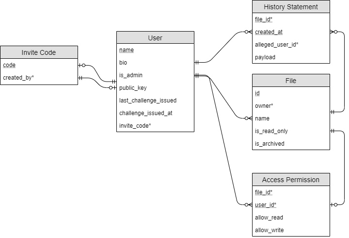
Users and Files have a many to many relationship through Access
Permission, Mandatory on the users side and optional on the files side.

## Data Dictionary

**Entity: User**

| Attribute               | Key | Type     | Size  | Required? | Validation                                                    |
|:------------------------|:----|:---------|:------|:----------|:--------------------------------------------------------------|
| name                    | PK  | VARCHAR  | 50    | Y         |                                                               |
| bio                     |     | VARCHAR  | 250   | N         |                                                               |
| is\_admin               |     | TINYINT  | 1 bit | Y         | 1 or 0 (boolean)                                              |
| public\_key             |     | CHAR     | 350   | Y         | Length = 350 chars (public key b64 encoded w/o prefix/suffix) |
| last\_challenge\_issued |     | CHAR     | 10    | N         | Length = 10                                                   |
| challenge\_issued\_at   |     | DATETIME |       | N         | &lt;= Current time                                            |
| invite\_code            | FK  | CHAR     | 10    | Y         | Lookup from InviteCode table                                  |

**Entity: Invite Code**

| Attribute   | Key | Type    | Size | Required? | Validation                                 |
|:------------|:----|:--------|:-----|:----------|:-------------------------------------------|
| code        | PK  | CHAR    | 10   | Y         | Randomly generated                         |
| created\_by | FK  | VARCHAR | 50   | Y         | User.is\_admin = 1, Lookup from User table |

**Entity: File**

| Attribute      | Key | Type    | Size    | Required? | Validation                   |
|:---------------|:----|:--------|:--------|:----------|:-----------------------------|
| id             | PK  | INT     | 32 bits | Y         | Auto Increment               |
| owner          | FK  | VARCHAR | 50      | Y         | Lookup from User table       |
| name           |     | VARCHAR | 250     | Y         |                              |
| is\_read\_only |     | TINYINT | 1 bit   | Y         | 1 or 0 (Boolean), Default: 0 |
| is\_archived   |     | TINYINT | 1 bit   | Y         | 1 or 0 (Boolean), Default: 0 |

**Entity: Access Permission**

| Attribute    | Key    | Type    | Size    | Required? | Validation             |
|:-------------|:-------|:--------|:--------|:----------|:-----------------------|
| file\_id     | PK, FK | INT     | 32 bits | Y         | Lookup from File table |
| username     | PK, FK | VARCHAR | 50      | Y         | Lookup from User table |
| allow\_read  |        | TINYINT | 1 bit   | Y         | 1 or 0 (Boolean)       |
| allow\_write |        | TINYINT | 1 bit   | Y         | 1 or 0 (Boolean)       |

**Entity: History Statement**

| Attribute         | Key | Type      | Size        | Required? | Validation             |
|:------------------|:----|:----------|:------------|:----------|:-----------------------|
| file\_id          | PK  | INT       | 32 bits     | Y         | Lookup from File table |
| created\_at       | PK  | DATETIME  |             | Y         | &lt;= Current time     |
| alleged\_username |     | VARCHAR   | 50          | Y         | Lookup from User table |
| payload           |     | VARBINARY | 3,584 bytes | Y         |                        |

## History Statement Payload Format

This is what the client will sign to verify the changes they made. It’s
stored in the History Statement table as ‘payload’.

| Name                                                  | size (bytes)        |
|:------------------------------------------------------|:--------------------|
| Hash of (signed) previous history statement           | 32                  |
| Hash of file when uploaded                            | 32                  |
| Username of uploader                                  | 50 (Padded)         |
| (Optional) Comment field                              | Up to 50 characters |
| **Total (Max)**                                       | 164                 |
| **Total After Encryption (Max), No encoding/Banners** | 3, 584              |

The whole history statement is signed by the user. Signing also adds a
hash so the total max is 7 blocks to sign \* 512 bytes per encrypted
block.

# Server design

This part details the design of the server, which is what the client
communicates with and directly interfaces with the database defined
above. The first half details some details used by the server
internally, whereas the second part details each API route and its
design.

## Internals

### Multithreading

As mentioned in the project proposal, the server will use
multithreading. The server will use a single master thread to handle
starting the server and receiving requests. When it receives a request,
it will start a new thread to handle it.

### Interfacing with the database

Making new database connections takes time, so if possible, the same
connection should be reused multiple times. To do this, some amount of
connections will be kept open and threads will ‘borrow’ one as needed.
Each connection will only have one thread using it at a time.

This will be accomplished using a queue which stores each connection.
When a thread needs a connection, it will take from this queue, then
return the connection to the queue when it's finished. The queue will be
locked when removing/adding items in order to avoid race conditions

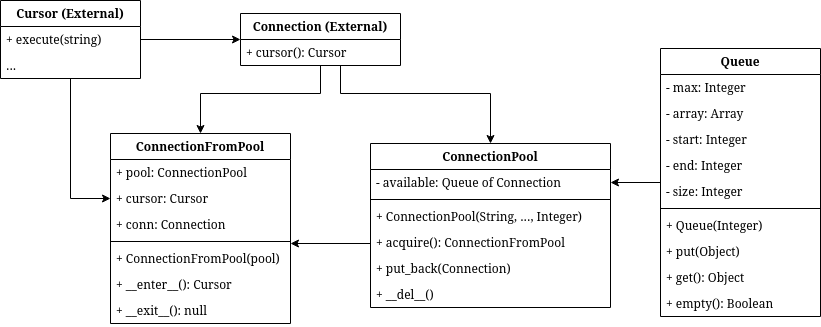

-   *\_\_del\_\_ is Python’s destructor method and is called when
    there’s no more references to the object, in this case when the
    server shuts down.*

-   *\_\_enter\_\_ and \_\_exit\_\_ allow us to use python’s with
    statement, which makes it obvious which parts of code use a
    connection. \_\_enter\_\_ returns the object we run queries with,
    \_\_exit\_\_() returns it to the pool.
    <https://www.geeksforgeeks.org/with-statement-in-python/>*

-   *Queue is a standard circular queue of size CONNECTION\_POOL\_SIZE.*

#### Pseudocode

##### ConnectionPool(host, port, username, password, database, pool\_size)

-   Initialise instance properties

-   Make however many connections we need

##### acquire()

-   Loop until we find a connection:

    -   Check if the queue is empty

        -   If it’s not, lock the queue

        -   Try to get a connection from the queue

    -   If it is empty, let other threads run

-   Once we find a connection, Check the connection is still valid

    -   If not, reconnect

-   Wrap it in a ConnectionFromPool and return it

##### put\_back(idx: Integer)

-   Put the connection back in the queue

#### ConnectionFromPool

##### \_\_enter\_\_()

-   Get a cursor from the connection we’re using

-   Return it

##### \_\_exit\_\_()

-   Commit all changes and close the cursor

##### \_\_del\_\_()

-   Return the connection to the pool

### Authentication

Since the server shouldn’t store users’ private keys, the best way to
verify a users’ identity is with a challenge/response format.

The client will make a request to /auth/getChallenge which will return a
random string. The client should then sign that string using their
private key and send the signed message to /auth/submitChallenge. The
server will then respond with a session cookie that can be used to
authenticate the user for subsequent requests.

This session cookie will be stored by the server in an object which is
shared between worker threads. To prevent race conditions, a lock will
be used for each session. This is automatically released when the
Session object is deleted.

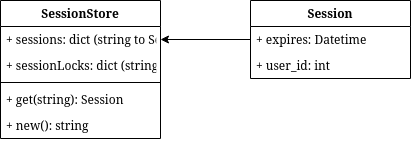

Further details, such as cookie/challenge expiry, are defined later.

### Request Parsing

Python provides some built-in http parsing which parses out the URI,
headers and cookies.

From this, the worker thread should figure out which function should
handle this request and pass that function a ‘Context’ object.

The worker should also pass a Handler object, through which the function
can send a response to the client.

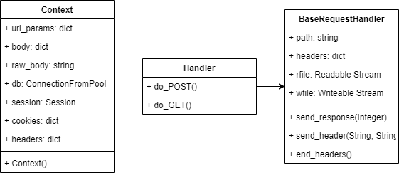

## Business Logic

This describes the required endpoints for the server which the client
will call in order to perform actions.

##### /register

**Input**

-   Invite code

-   Desired name and bio

-   Public key

**Process**

-   Get inputs from request

<!-- -->

-   Verify name, bio and public key (OR error)

-   Verify invite code is valid and exists (OR error)

-   Add the user to the database

-   Return details of new user

**Output**

-   Details of new user

-   OR ‘Not valid’ if invite key or input is invalid

##### /admin/genInviteCode

**Input**

-   Authorisation

**Process**

-   Verify authorisation (OR error)

-   Verify user is admin (OR error)

-   Generate random string

-   Save to database as invite code

-   Return invite code

**Output**

-   Invite code

-   OR ‘Not authorised’ error if auth invalid OR not admin

##### /auth/getChallenge

**Input**

-   Username to sign in as

**Process**

-   Get user to try and sign in as (OR error)

-   Generate random string

-   Save to database as last challenge issued

-   Save now as time of last challenge issue

-   Return challenge

**Output**

-   Challenge to solve

-   OR ‘Not found’ error if user not found

##### /auth/submitChallenge

**Input**

-   Username to sign in as

-   Signed challenge

**Process**

-   Get inputs from request (OR error)

-   Get user from database (OR error)

-   Verify challenge issued within 10 minutes (OR error)

-   Decrypt signed challenge with public key

-   Verify equal to last challenge issued (OR error)

-   Generate random session token

-   Store it as session token for this user

-   Return session token

**Output**

-   Session token

##### /file/create

**Input**

-   Authorisation

-   Name of file

-   Initial Contents of file

-   Signed history statement with all 0s as the hash for the previous
    history statement

**Process**

-   Get inputs from request

-   Verify the users’ authorisation (OR error)

-   Verify the name is valid (OR error)

-   Verify the history statement (OR error)

-   Save the file to disk

-   Add to the database

-   Return success

**Output**

-   Success message

-   OR ‘Not authorised’ if authorisation is invalid

-   OR ‘Not valid’ if input is invalid

##### /file/download

**Input**

-   Authorisation

-   ID of file to download

**Processes**

-   Get inputs from request

-   Verify the users’ authorisation (OR error)

-   Verify they have read access to the file (OR error)

-   Find the location of the latest iteration on disk

-   Respond with the contents of that file

**Output**

-   Contents of file

-   OR ‘Not authorised’ error if auth invalid or no permissions

-   OR ‘No longer archived’ error if that iteration has been deleted

##### /file/upload

**Input**

-   Authorisation

-   ID of file to upload to

-   Signed history statement

-   File to upload

**Processes**

-   Get inputs from request (OR error)

-   Verify the users’ authorisation (OR error)

-   Verify they have write access to the file (OR error)

-   Verify their history statement

-   Save the file to disk

-   Save the history statement to the database

-   Respond with success

**Output**

-   Success message

-   OR ‘Not authorised’ error if auth invalid or no permissions

-   OR ‘Not continuous’ error if history statement isn’t based off the
    last one on the server

-   OR ‘Not valid’ error if history statement doesn’t match uploaded
    file

##### /file/setOptions

**Input**

-   Authentication

-   ID of file to change

-   New Is archived

-   New Is read-only

**Process**

-   Get inputs from request

-   Verify authentication (or error)

-   Update the file in the database

-   Return success

**Output**

-   Success message

-   OR ‘Not authorised’ error if auth invalid or not owner of file

##### /file/setPermissions

**Input**

-   Authentication

-   ID of file to change permissions for

-   Name of user to change permissions for

-   Can that user read?

-   Can that user write?

**Process**

-   Get inputs from request

-   Verify authentication (or error)

-   Get file to change

-   Add the new access permission, or amend it if it exists

-   Return success

**Output**

-   Success message

-   OR ‘Not authorised’ error if auth invalid or not owner of file

##### /file/getHistory

**Input**

-   Authorisation

-   ID of file to query

**Processes**

-   Get inputs from request

-   Verify the users’ authorisation (OR error)

-   Verify they have read access to the file (OR error)

-   Get the file history from the database

-   Return it

**Output**

-   All history statements for file

-   OR ‘Not authorised’ error if auth invalid or no permissions

##### /files

**Input**

-   Authorisation

**Processes**

-   Verify the users’ authorisation (OR error)

-   Get the files they have any access to from the database

-   Return them

**Output**

-   All files the user has access to

-   OR ‘Not authorised’ error if auth invalid

##### /directory

**Input**

-   Authorisation

**Processes**

-   Verify the users’ authorisation (OR error)

-   Get the users from the database

-   Return them

**Output**

-   All users in the database

-   OR ‘Not authorised’ error if auth invalid

# Client Design

The client will be a GUI application that the user installs locally. It
will then connect back to the remote server.

In practice, this could be installed on many PCs by an organisation and
then connect to that organisation’s local server.

## Structure

The app will run from a Main app class, which will hold exactly one View
at a time. This View controls the current GUI and can swap itself out
for another view, passing arguments to the new instance.

The App class will also store a Config object, which will attempt to
parse the saved user configuration on startup and save it for use.

## Config Format

The config file will be stored in the application’s directory as
secureVCS.config and serialised from a dictionary using python’s pickle
library.

### Config dictionary

| Name              | Purpose                                                     | Data Type               |
|:------------------|:------------------------------------------------------------|:------------------------|
| Username          | Used to identify the user when authenticating to the server | String                  |
| Is Admin          | Used to know if the user can generate invite codes          | Boolean                 |
| Server Base URL   | Used to contact the server                                  | String                  |
| Is key encrypted? | Specifies the format the key field is in                    | Boolean                 |
| Key               | Used for authentication                                     | String                  |
| Local Files       | Used for tracking                                           | Dictionary of LocalFile |

If the user chooses to encrypt their key, is\_key\_encrypted is true and
the key field is encrypted. AES is used with a SHA256 hash of the user’s
password to encrypt the full serialised keypair. This is then base64
encoded. If is key encrypted is set then when the application starts it
will prompt the user for a password and loop until the key is
successfully decrypted.

If user doesn’t encrypt their key, is\_key\_encrypted is false and key
is the serialised keypair.

is\_admin is updated whenever the user authenticates to the server.

### Local file format

| Name                       | Purpose                                                              | Data Type  |
|:---------------------------|:---------------------------------------------------------------------|:-----------|
| Path                       | Where the file is on the disk                                        | Path       |
| File ID                    | The ID of the file on the server, to upload it back up to the server | Number     |
| Hash when acquired         | To tell if the file has been modified or not                         | Byte array |
| Previous history statement | To base the new history statement off of                             | Byte array |

## UI Design

### Initial Setup (Step 1)

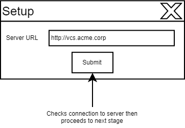

### Initial Setup (Step 2)

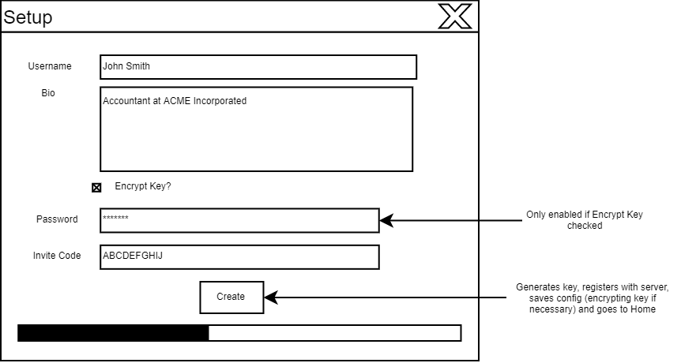

### Home

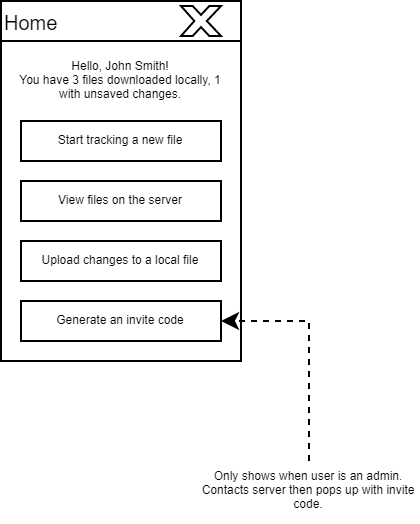

### Start Tracking a new file

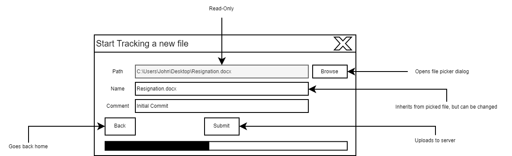

### View Files on the Server

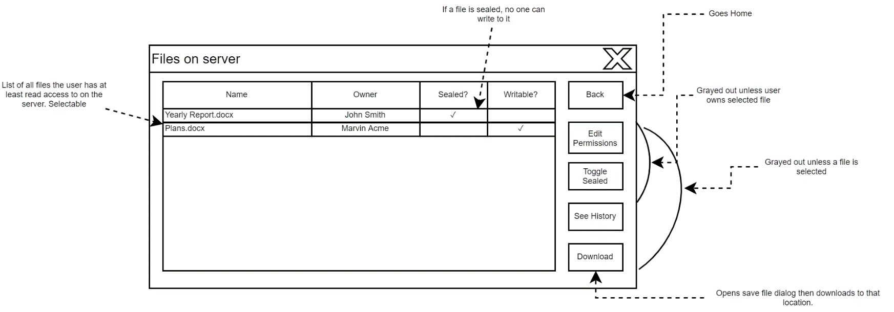

### Edit Permissions

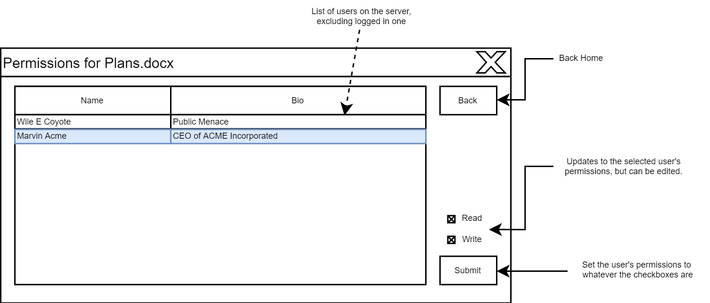

### See History

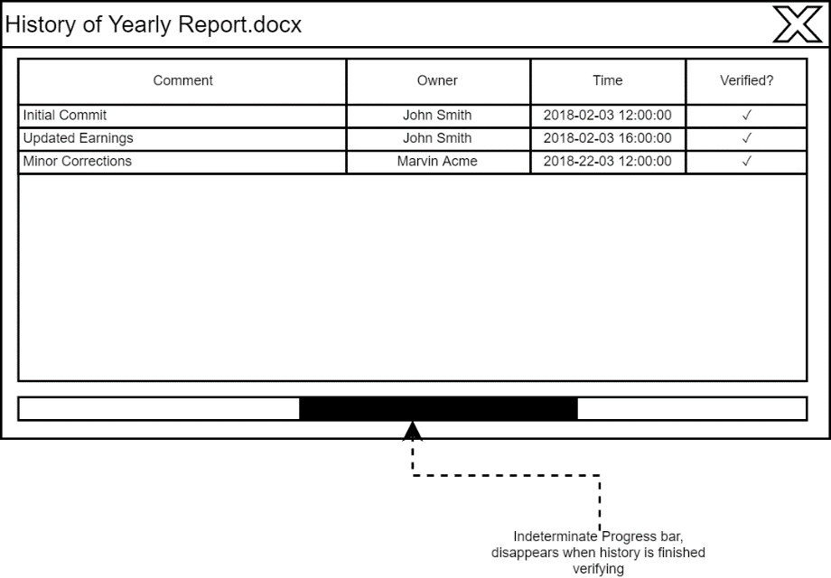

### Upload Local Changes

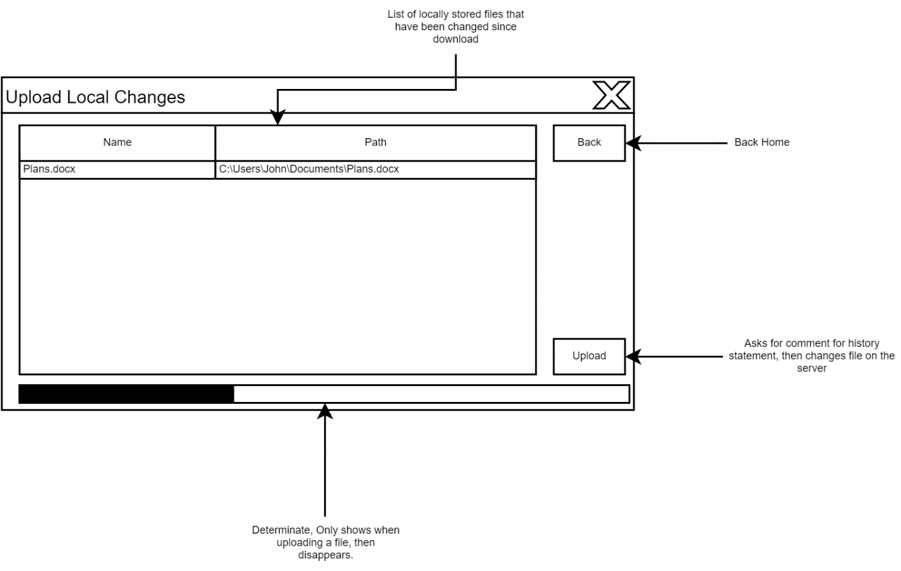

## Pseudocode

### Startup

1.  Initialise GUI library

2.  Try to load config

3.  If it fails, Show the initial setup view

4.  If it succeeds, Show the home view

#### Try to load config

1.  Get the Path the config should exist at: User
    directory/secureVCS.config

2.  If the file doesn’t exist, Config is invalid

3.  If it does exist:

4.  Read the file

5.  Deserialise the file (OR invalid)

6.  Load the username, is\_admin, baseServerUrl and key\_is\_encrypted
    (OR invalid)

7.  Decrypt/deserialise the key if needed (OR invalid)

8.  Load the list of local files (OR invalid)

9.  If we get here without something going wrong, the config is valid

##### 7. Decrypt/Deserialise the key if needed

1.  Get the raw key from the file

2.  If key\_is\_encrypted is false,

3.  Deserialise the raw key (or invalid)

4.  Otherwise:

5.  Loop until the key is successfully decrypted:

6.  Ask the user for a password

7.  If they don’t give a password, mark the config as invalid and break
    out of loop

8.  Try decrypting with that password

9.  If the decrypted bytes start with ‘---BEGIN PRIVATE KEY---’:

    -   Deserialise the decrypted key (OR invalid)

    -   Break out of loop

10. Otherwise, display an error message

11. Back to loop

##### 7.8 Try decrypting with that password

1.  Hash the user the password gave

2.  Decrypt AES using the hashed password

### Setup (Stage 1) View

#### On submit

1.  Get the server base URL

2.  Make a test connection

3.  If it succeeds, go to the next view, passing it this URL

4.  If it fails, notify the user and let them try again

### Setup (Stage 2) View

#### On Submit

1.  Get inputs from entries

2.  Check validity

3.  Disable all inputs

4.  Register the user

5.  Show a success message and go to the home view

##### 2. Check validity

1.  Initialise a blank list for error messages

2.  If username is blank, add an error message

3.  If username is too long, add an error message

4.  If bio is too long, add an error message

5.  If user chose to encrypt key but didn’t enter password, add an error
    message

6.  If invite code isn’t 10 alphanumeric characters, add an error
    message

7.  If there’s any error messages:

8.  Display them

9.  Return

10. Otherwise, continue

##### 4. Register the user

1.  Generate an RSA Key

2.  Send a request to the server

3.  If it succeeds, Populate the config

4.  Otherwise:

5.  Show the error

6.  Re-enable all inputs

##### 4.3. Populate the config

1.  Store the server base url, username, if the key is encrypted

2.  Set is\_admin to false as a default

3.  Store an empty list for local files

4.  Store the unencrypted key in memory

5.  If the key is encrypted:

    1.  Hash the user’s password

    2.  Serialise the key

    3.  Encrypt the serialised key using the password hash

    4.  Store it as the raw key (which gets saved to the file)

6.  Otherwise:

    1.  Serialise the key

    2.  Store it as the raw key

7.  Save the config to file

### Authenticate to the server

Cookies will be stored through all requests in the App object.
auth\_expires will also store the time the session expires as seconds
since 00:00:00 01/01/1970, 0 to start with.

1.  If auth\_expires is greater than the current time, Return

2.  Otherwise, get the authentication challenge from the server

3.  Sign the challenge

4.  Submit the challenge

5.  Check we succeeded

6.  If so:

    1.  The auth cookie will already be stored

    2.  Update auth\_expires to 2 hours from now

    3.  If the response says we’re an admin, make sure our config has
        is\_admin set to true

7.  Otherwise, Throw an error

### Upload local changes

#### Initialisation

1.  Initialise GUI Widgets

2.  Add the changed files to a table

##### 2. Add the changed files to a table

1.  Get a list of changed files

2.  Sort the list by filename

3.  Display them in a table

##### 2.1. Get a list of changed files

1.  Initialise an empty list of changed files

2.  For each locally stored file,

3.  If it no longer exists, remove it from the list

4.  Otherwise, hash the file

5.  If the current hash is different from the hash stored, add it to the
    list of changed files

### View file history

#### Initialisation

1.  Initialise GUI widgets

2.  Start a new worker thread to parse the history

3.  Schedule a recurring task to check what it’s done every half a
    second

#### Worker thread (Parse history)

1.  Get a list of all users on the server

2.  Get a list of all history statements for this file

3.  Decrypt and verify each history statement

##### 1. Get a list of all users on the server

1.  Make sure we have a valid session

2.  Request the list of users from the server

3.  Sort the list of users

4.  If it fails, throw an error

5.  Otherwise, store the result locally as a list

Note that the response from the server is already sorted by username

##### 3. Decrypt and verify each history statement

1.  Initialise previous hash as a bytearray of 32 0s

2.  For each history statement,

    1.  Get the username who supposedly made it

    2.  Use binary search to find that users public key from the list of
        all users

    3.  Use their public key to decrypt the history statement

    4.  If it succeeds, check the statement is valid

    5.  If it’s valid, send a message to the main thread with details
        about the history statement

    6.  Otherwise, send a message to the main thread saying there’s an
        invalid statement

    7.  Either way, hash this history statement

    8.  Set previous hash to the hash of this history statement

3.  Tell the main thread we’re done verifying history statements

##### 3.2.e If it’s valid, …

1.  If the history statement’s username doesn’t match the username it’s
    meant to be, it’s invalid

2.  If its previous hash doesn’t match our previous hash, it’s invalid

3.  Otherwise, It’s valid

#### Main thread (Display parsed history)

1.  Animate the progress bar

2.  Check if the worker thread has finished any more statements

3.  If it has, get them and add them to the table

4.  Otherwise, come back in half a second

# Testing

Each cryptographic function (hashing, AES and RSA) will be tested by
calling the functions directly with known parameters and comparing its
output to known good values

## AES

These test vectors are provided by the NIST’s Cryptographic Algorithm
Validation Program. Whilst this module isn’t aiming to meet NIST’s full
list of standards, these test vectors provide a large range of cases and
should ensure the algorithms are properly implemented.

Tests are performed first with the same key and differing plaintext,
then with the same plaintext and a variety of keys.

The full NIST test plan can be found here:
<https://csrc.nist.gov/CSRC/media/Projects/Cryptographic-Algorithm-Validation-Program/documents/aes/AESAVS.pdf>.
Only parts of each section have been shown as a total of 405 vectors are
supplied in all. All inputs/outputs are in hexadecimal.

The full list is stored as a .csv file in Tests/Crypto/aes.csv. The
run\_aes.py script in the same directory will automatically run every
vector and report any errors. The run\_all.bat script will run all
cryptography tests. All tests passed.

**Varying plaintext, With Key:**
0000000000000000000000000000000000000000000000000000000000000000

| Input                            | Expected Output                  |
|:---------------------------------|:---------------------------------|
| 014730f80ac625fe84f026c60bfd547d | 5c9d844ed46f9885085e5d6a4f94c7d7 |
| 0b24af36193ce4665f2825d7b4749c98 | a9ff75bd7cf6613d3731c77c3b6d0c04 |
| …                                | …                                |
| 80000000000000000000000000000000 | ddc6bf790c15760d8d9aeb6f9a75fd4e |
| c0000000000000000000000000000000 | 0a6bdc6d4c1e6280301fd8e97ddbe601 |
| e0000000000000000000000000000000 | 9b80eefb7ebe2d2b16247aa0efc72f5d |
| f0000000000000000000000000000000 | 7f2c5ece07a98d8bee13c51177395ff7 |
| f8000000000000000000000000000000 | 7818d800dcf6f4be1e0e94f403d1e4c2 |
| …                                | …                                |

**Varying key, With plaintext:** 00000000000000000000000000000000

| Input Key                                                        | Expected output                  |
|:-----------------------------------------------------------------|:---------------------------------|
| c47b0294dbbbee0fec4757f22ffeee3587ca4730c3d33b691df38bab076bc558 | 46f2fb342d6f0ab477476fc501242c5f |
| 28d46cffa158533194214a91e712fc2b45b518076675affd910edeca5f41ac64 | 4bf3b0a69aeb6657794f2901b1440ad4 |
| c1cc358b449909a19436cfbb3f852ef8bcb5ed12ac7058325f56e6099aab1a1c | 352065272169abf9856843927d0674fd |
| …                                                                | …                                |
| 8000000000000000000000000000000000000000000000000000000000000000 | e35a6dcb19b201a01ebcfa8aa22b5759 |
| c000000000000000000000000000000000000000000000000000000000000000 | b29169cdcf2d83e838125a12ee6aa400 |
| e000000000000000000000000000000000000000000000000000000000000000 | d8f3a72fc3cdf74dfaf6c3e6b97b2fa6 |
| f000000000000000000000000000000000000000000000000000000000000000 | 1c777679d50037c79491a94da76a9a35 |
| f800000000000000000000000000000000000000000000000000000000000000 | 9cf4893ecafa0a0247a898e040691559 |
| …                                                                | …                                |

## SHA-2 (256 bits)

As above, NIST vectors are used which can be found here.
<https://csrc.nist.gov/csrc/media/projects/cryptographic-standards-and-guidelines/documents/examples/sha_all.pdf>

These mostly test that the hash can generate accurate values for any
arbitrary length, including extremely large inputs. One vector was
omitted as it resulted in an input &gt;1GB in memory, which Python
struggles with on many computers.

All tests passed. They can be run again with the test script located at
Tests/Crypto/run\_hash.py

| Input                                                                                                            | Expected Output                                                  |
|:-----------------------------------------------------------------------------------------------------------------|:-----------------------------------------------------------------|
| abc                                                                                                              | ba7816bf8f01cfea414140de5dae2223b00361a396177a9cb410ff61f20015ad |
| "" (Empty string)                                                                                                | e3b0c44298fc1c149afbf4c8996fb92427ae41e4649b934ca495991b7852b855 |
| abcdbcdecdefdefgefghfghighijhijkijkljklmklmnlmnomnopnopq                                                         | 248d6a61d20638b8e5c026930c3e6039a33ce45964ff2167f6ecedd419db06c1 |
| abcdefghbcdefghicdefghijdefghijkefghijklfghijklmghijklmnhijklmnoijklmnopjklmnopqklmnopqrlmnopqrsmnopqrstnopqrstu | cf5b16a778af8380036ce59e7b0492370b249b11e8f07a51afac45037afee9d1 |
| ‘a’ repeated a million times                                                                                     | cdc76e5c9914fb9281a1c7e284d73e67f1809a48a497200e046d39ccc7112cd0 |

## RSA

RSA was tested by generating a new random key then, for each of the
following payloads, encrypting and decrypting, then signing and
verifying. The output from decrypting and from verifying should be the
original input. Serialising and then deserialising the keypair was also
tested.

| 16 Bytes: \[0, 1, 2, 3, 4, 5, 6, 7, 8, 9, 10, 11, 12 , 13, 14, 15\] |
|:--------------------------------------------------------------------|
| String: ‘1234567890abcdef’                                          |
| 128 bytes: \[0, 1, 2, 3, …, 125, 126, 127\]                         |
| 512 random bytes                                                    |
| 4096 random bytes                                                   |

All tests passed. They can be run again with the script located at
Tests/Crypto/run\_rsa.py

# 

# Integration

These tests are done to ensure that all the smaller parts of the
solution are working together correctly. In this case, the stated inputs
were entered into the client. Tests are done for each user requirement
and include invalid inputs to test the robustness of the solution. When
run, all tests passed.

To aid in this testing a script was made to generate seed/fake data. It
is in Server/seed.py. It generates 3 users (Alice, Bob and Charlie), and
creates 3 test files. Seed data has already been generated in the
provided database and the configuration files to login as each of the
users provided. So to log in as Charlie, copy secureVCS\_C.config to
Client/secureVCS.config and use the encryption key ‘1234’

**User Creation**

*Users can use a generated invite code to create a new account on the
server.*

Between each of these cases the database was reset and the invite code
(WYSWUW6YZS) re-added.

| **Server URL**                                           | **Username**  | **Bio**       | **Encrypt Key?** | **Encryption Key** | **Invite Code**      | **Expected Output**                                |     | **Notes**                                                                                                           |
|:---------------------------------------------------------|:--------------|:--------------|:-----------------|:-------------------|:---------------------|:---------------------------------------------------|-----|:--------------------------------------------------------------------------------------------------------------------|
| [<u>http://asdfghjkl.local</u>](http://asdfghjkl.local/) | \-            | \-            | \-               | \-                 | \-                   | Connection to server failed.                       |     | Other inputs not required, since we don't get past the first dialog                                                 |
| [<u>http://127.0.0.1</u>](http://127.0.0.1/)             | Alice Ace     | Some bio      | ✔                | 1234               | WYSWUW6YZS           | Success                                            |     |                                                                                                                     |
| [<u>http://127.0.0.1</u>](http://127.0.0.1/)             |               | Some bio      |  ✔               | 1234               | WYSWUW6YZS           | Username is required                               |     |                                                                                                                     |
| [<u>http://127.0.0.1</u>](http://127.0.0.1/)             | "a" 255 times | Some bio      |  ✔               | 1234               | WYSWUW6YZS           | Username is too long (max 50 characters)           |     |                                                                                                                     |
| [<u>http://127.0.0.1</u>](http://127.0.0.1/)             | Alice Ace     | "a" 512 times |  ✔               | 1234               | WYSWUW6YZS           | Bio is too long                                    |     |                                                                                                                     |
| [<u>http://127.0.0.1</u>](http://127.0.0.1/)             | Alice Ace     | Some bio      |  ✔               |                    | WYSWUW6YZS           | Password is required when encrypting key           |     |                                                                                                                     |
| [<u>http://127.0.0.1</u>](http://127.0.0.1/)             | Alice Ace     | Some bio      |  ✔               | 1234               | 12345678901234567890 | Invalid invite code                                |     |                                                                                                                     |
| [<u>http://127.0.0.1</u>](http://127.0.0.1/)             | Alice Ace     | Some bio      |  ✔               | 1234               |                      | Invite code is required                            |     |                                                                                                                     |
| [<u>http://127.0.0.1</u>](http://127.0.0.1/)             | Alice Ace     | Some bio      |  ✔               | 1234               | ABC-3FG\#I!          | Invalid invite code                                |     |                                                                                                                     |
| [<u>http://127.0.0.1</u>](http://127.0.0.1/)             | Alice Ace     | Some bio      |  ✔               | 1234               | ZZZZZZZZZZ           | Invite code doesn't exist or has already been used |     |                                                                                                                     |
| [<u>http://127.0.0.1</u>](http://127.0.0.1/)             | Alice Ace     | Some bio      |  ✔               | 1234               | ETJK1BHJMH           | Username already exists                            |     | Must be performed after Success case without deleting user. Config should be reset and a new invite code generated. |
| [<u>http://127.0.0.1</u>](http://127.0.0.1/)             | Alice Ace     | Some bio      |  ✖               | \-                 | WYSWUW6YZS           | Success                                            |     |                                                                                                                     |

**File Creation Tests**

*Users can add new files to be tracked that aren’t based on any previous
file.*

| **Filename**           | **Path to file**        | **Comment**   | **Expected Output**                       |     | **Notes**                                                                                   |
|:-----------------------|:------------------------|:--------------|:------------------------------------------|-----|:--------------------------------------------------------------------------------------------|
| Plans.docx             | Desktop/Plans.docx      | Start plans   | Success                                   |     |                                                                                             |
|                        | Desktop/Plans.docx      | Start plans   | Filename is required                      |     |                                                                                             |
| Plans.docx             | Desktop/--Nonexistent-- | Start plans   | File does not exist                       |     | To get past open dialog's validation, create file, select it, then delete before submitting |
| Plans.docx             | Desktop/Plans.docx      | "a" 128 times | Comment too long (max 50 characters)      |     |                                                                                             |
| "a" repeated 255 times | Desktop/Plans.docx      | Start plans   | Filename is too long (max 250 characters) |     |                                                                                             |

**Permission and File changes**

*Users can change the options for files they own*

*Users can control who can read/write to files they own.*

These files were generated by the seed data. The contents/history don’t
matter.

| **Acting as** | **File Owner** | **Action**                                       | **Expected Output**                                                       |     | **Notes**               |
|:--------------|:---------------|:-------------------------------------------------|:--------------------------------------------------------------------------|-----|:------------------------|
| Alice Ace     | Alice Ace      | "Toggle read-only" on a writable file.           | File is marked as read-only                                               |     |                         |
| Alice Ace     | Alice Ace      | "Toggle read-only" on a read-only file.          | File is no longer read-only                                               |     |                         |
| Alice Ace     | Alice Ace      | "Archive" on a non-archived file                 | "Are you sure" prompt then File is archived and no longer listed anywhere |     |                         |
| Bob Belcher   | Alice Ace      | "Toggle read-only" on a writable file.           | User isn't owner, button is greyed out                                    |     |                         |
| Bob Belcher   | Alice Ace      | "Toggle read-only" on a read-only file.          | User isn't owner, button is greyed out                                    |     |                         |
| Bob Belcher   | Alice Ace      | "Archive" on a non-archived file                 | User isn't owner, button is greyed out                                    |     |                         |
| Alice Ace     | Alice Ace      | View permisisons for file                        | User list, permissions viewable for each                                  |     |                         |
| Alice Ace     | Alice Ace      | Grant 'Charlie Chaplin' Read & Write permissions | Charlie Chaplin can read or write file                                    |     |                         |
| Alice Ace     | Alice Ace      | Revoke 'Charlie Chaplin' Write permissions       | Charlie Chaplin has only read permissions for file                        |     | Executed after prev row |
| Alice Ace     | Alice Ace      | Revoke 'Charlie Chaplin' Read permissions        | Charlie Chaplin has no permissions and can't see file at all              |     | Executed after prev row |
| Alice Ace     | Alice Ace      | Grant 'Charlie Chaplin' ONLY Write permissions   | Charlie Chaplin given Read & Write permissions                            |     |                         |
| Bob Belcher   | Alice Ace      | View permisisons for file                        | User isn't owner, button is greyed out                                    |     |                         |

**File Download Tests**

*Users can download files they have read access to*

*File owners can archive files to prevent reading*

| **User**    | **File Owner** | **User can read?** | **Is archived?** | **Is sealed?** | **File in seed data**   | **Expected Output**         |     |     |
|:------------|:---------------|:-------------------|:-----------------|:---------------|:------------------------|:----------------------------|-----|-----|
| Alice Ace   | Alice Ace      |                    | ✖                | ✖              | Business plans.txt      | Success                     |     |     |
| Alice Ace   | Alice Ace      |                    |  ✖               | ✔              | Business plans.txt      | Success                     |     |     |
| Alice Ace   | Alice Ace      |                    |  ✔               |                | 2007 Product Lineup.txt | Not listed, can't download. |     |     |
| Bob Belcher | Alice Ace      |  ✔                 | ✖                | ✖              | Business plans.txt      | Success                     |     |     |
| Bob Belcher | Alice Ace      |  ✔                 | ✖                |  ✔             | Business plans.txt      | Success                     |     |     |
| Bob Belcher | Alice Ace      |  ✔                 | ✔                |                | 2007 Product Lineup.txt | Not listed, can't download. |     |     |
| Alice Ace   | Bob Belcher    |  ✖                 | ✖                | ✖              | Honeymoon plans.txt     | Not listed, can't download. |     |     |

**File Upload Tests**

*Users can upload changes to files they have write access to*

*File owners can seal files to prevent reading*

| **User**        | **Owner** | **Can read?** | **Can write?** | **Is sealed?** | **Is archived?** | **File changed on disk?** | **File in seed data**    | **Expected Output**              |     |     |
|:----------------|:----------|:--------------|:---------------|:---------------|:-----------------|:--------------------------|:-------------------------|:---------------------------------|-----|-----|
| Alice Ace       | Alice Ace |               |                | ✖              | ✖                | ✔                         | Business plans.txt       | Success                          |     |     |
| Alice Ace       | Alice Ace |               |                | ✔              |  ✖               |  ✔                        | Business plans.txt       | File not found or isn't writable |     |     |
| Bob Belcher     | Alice Ace |  ✔            | ✔              |  ✖             |  ✖               |  ✔                        | Business plans.txt       | Success                          |     |     |
| Charlie Chaplin | Alice Ace |  ✔            | ✖              |  ✖             |  ✖               |  ✔                        | Business plans.txt       | File not found or isn't writable |     |     |
| Bob Belcher     | Alice Ace |  ✔            |  ✔             |  ✔             |  ✖               |  ✔                        | 2019 Progress Report.txt | File not found or isn't writable |     |     |
| Alice Ace       | Alice Ace |               |                |                | ✔                |  ✔                        | 2007 Product Lineup.txt  | File not found or isn't writable |     |     |
| Bob Belcher     | Alice Ace |  ✔            |  ✔             |                |  ✔               |  ✔                        | 2007 Product Lineup.txt  | File not found or isn't writable |     |     |
| Alice Ace       | Alice Ace |  ✔            |  ✔             |  ✖             |  ✖               |  ✖                        | Business plans.txt       | Not listed for uploading         |     |     |
| Bob Belcher     | Alice Ace |  ✔            |  ✔             | ✖              |  ✖               |  ✖                        | Business plans.txt       | Not listed for uploading         |     |     |

**Generate Invite Code**

*Admins can generate invite codes*

| **User**    | **Is admin?** | **Action**                   | **Expected Result**                                          |     |
|:------------|:--------------|:-----------------------------|:-------------------------------------------------------------|-----|
| Alice Ace   | ✔             | View home view               | Generate Invite Code' button at the bottom of the screen     |     |
| Alice Ace   | ✔             | Click 'Generate Invite Code' | Invite code generated, copied to clipboard and message shown |     |
| Bob Belcher | ✖             | View home view               | No 'Generate Invite Code' button displayed                   |     |

# Evaluation

## Fitness for Purpose

Below are a condensed list of the original functional requirements:

| Functional Requirement                            | Satisfied? | Testing     |
|:--------------------------------------------------|:-----------|:------------|
| File Hashing                                      | ✔          | Unit        |
| Public key cryptography, including key generation | ✔          | Unit        |
| Symmetric Encryption of keypairs                  | ✔          | Unit        |
| Download files from server                        | ✔          | Integration |
| Upload changes to server                          | ✔          | Integration |
| Change options for a file                         | ✔          | Integration |
| Change permissions for a file                     | ✔          | Integration |
| Create a new user                                 | ✔          | Integration |
| Generate invite codes                             | ✔          | Integration |

I am confident that my solution meets the functional and user
requirements set out and thus that the solution is fit for purpose.

## Robustness

Both the client and the server implement validity checks for the data
given to them. For example, length and required checks when creating a
new user, as well as foreign key constraints being used in the database
to ensure referential integrity.

As part of the test plan all inputs were also tested with invalid data
and an error was expected to be thrown. All these exceptional cases
displayed errors as expected, showing that the solution is correctly
checking validity. This proves that the solution can recover from many
cases of user error and thus is robust.

## Maintainability

The source code of the program is heavily commented and is separated
into many files, making it easier to understand and to edit. The
external libraries used are all actively maintained and the program
itself targets the latest version of Python, meaning problems with
external libraries should be easier to resolve. This should make
corrective and perfective maintenance easier.

Since the server is separate from the client and communicates using a
common protocol (HTTP), adaptive maintenance should also be easier, as a
client that targets a different platform would communicate with the
server the same way the current client does.

Overall, this means that the solution is maintainable.

## 

## 

## Scheduling

Below is a comparison of the initial plan (blue) vs the actual progress
(orange). Breaks are highlighted in black and the deadline is red.

| Milestone | Task                        | Expected Start | Expected End | Actual Start | Actual End |
|:----------|:----------------------------|:---------------|:-------------|:-------------|:-----------|
| Analysis  | Feasibility Study           | 19/11/2019     | 19/11/2019   | 19/11/2019   | 19/11/2019 |
| Analysis  | Requirements                | 20/11/2019     | 20/11/2019   | 21/11/2019   | 21/11/2019 |
| Analysis  | Cryptography Research       | 22/11/2019     | 28/11/2019   | 22/11/2019   | 28/11/2019 |
| Design    | Cryptography Design         | 29/11/2019     | 01/12/2019   | 29/11/2019   | 05/12/2019 |
| Design    | Database Design             | 02/12/2019     | 03/12/2019   | 06/12/2019   | 10/12/2019 |
| Design    | Client UI Design            | 04/12/2019     | 10/12/2019   | 11/12/2019   | 13/12/2019 |
| Design    | Server Design               | 11/12/2019     | 17/12/2019   | 14/12/2019   | 20/12/2019 |
|           | BREAK                       | 21/12/2019     | 26/01/2020   |              |            |
| Server    | Cryptography Implementation | 27/01/2020     | 31/01/2020   | 27/01/2020   | 05/02/2020 |
| Server    | Database Implementation     | 01/02/2020     | 02/02/2020   | 06/02/2020   | 06/02/2020 |
| Server    | Server Implementation       | 03/02/2020     | 13/02/2020   | 07/02/2020   | 20/02/2020 |
| Client    | Client Implementation       | 14/02/2020     | 19/02/2020   | 21/02/2020   | 02/03/2020 |
| Testing   | Crypto Testing              | 20/02/2020     | 22/02/2020   | 03/03/2020   | 05/03/2020 |
| Testing   | Integration Testing         | 23/02/2020     | 29/02/2020   | 06/03/2020   | 12/03/2020 |
|           | DEADLINE                    | 13/03/2020     |              |              |            |

From this comparison we can see that Cryptography research and
implementation took much longer than initially planned, whereas Client
UI design didn’t take as long as estimated. Client implementation also
took longer than initially planned.

Whilst the project took longer than planned, it was still finished by
the deadline.

# Bibliography

[1] Forging SSL Certificates, Schneier on Security,
<https://www.schneier.com/blog/archives/2008/12/forging_ssl_cer.html>
(Last Accessed 03/12/19)

[2] ‘We have broken SHA-1 in practice’, Centrum Wiskunde & Informatica,
<https://shattered.io/> (Last Accessed 03/12/19)

[3] Time Complexity (Exploration), Brit Cruise, Khan Academy,
<https://www.khanacademy.org/computer-programming/time-complexity-exploration/1466763719>
(Last Accessed 03/12/2019)

[4] Euler’s Totient Function, Brit Cruise, Khan Academy,
<https://www.khanacademy.org/computing/computer-science/cryptography/modern-crypt/v/euler-s-totient-function-phi-function>
(Last Accessed 03/12/19)

[5] Primality Tests, Ben Lynn, Stanford University,
<https://crypto.stanford.edu/pbc/notes/numbertheory/millerrabin.html>
(Last Accessed 03/12/2019)

[6] Roots of Polynomials, Ben Lynn, Stanford University,
<https://crypto.stanford.edu/pbc/notes/numbertheory/poly.html> (Last
accessed 03/12/2019)

[7] Extended Euclidean Algorithm, Thaddeus Abiy, Brilliant,
<https://brilliant.org/wiki/extended-euclidean-algorithm/> (Last
accessed 03/12/2019)
